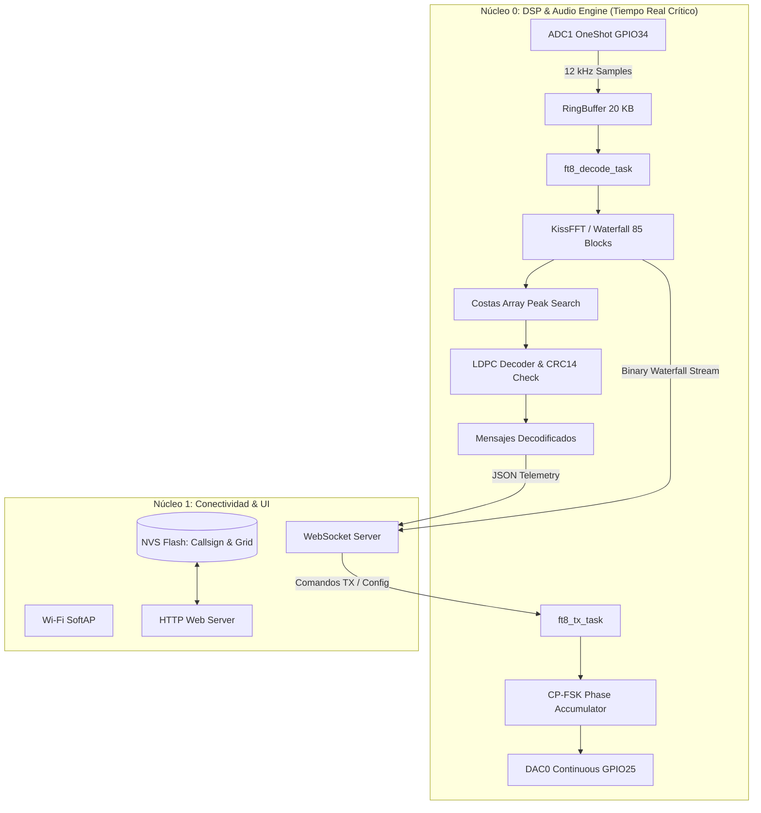

# 📻 MAP-FT8: Módem Autónomo Portable para Modos Digitales (FT8) con ESP32

[](https://www.espressif.com/)
[](https://docs.espressif.com/projects/esp-idf/en/latest/)
[](https://www.freertos.org/)
[](https://physics.princeton.edu/pulsar/k1jt/wsjtx.html)
[](LICENSE)

> **Proyecto Final de la asignatura Sistemas Embebidos**  
> *Departamento de Ciencias e Ingeniería de la Computación — Universidad Nacional del Sur (UNS)*  
> **Autores:** Manuel Tauro ([@ManuT18](https://github.com/ManuT18)), Tomás Aguirre.

---

## 🌟 Resumen Ejecutivo

**MAP-FT8** es un transceptor y módem autónomo de modos digitales basado en el SoC **ESP32** (dual-core 240 MHz). Permite a operadores de radioafición codificar y decodificar señales del protocolo digital **FT8** directamente en el microcontrolador, **eliminando por completo la necesidad de una computadora portátil (PC) en campo**.

El dispositivo actúa como un puente inteligente entre la radio y el operador: digitaliza el audio del transceptor mediante ADC/DMA, ejecuta la cadena completa de Procesamiento Digital de Señales (DSP con FFT, detección de patrones Costas y corrección de errores LDPC), sintetiza las tramas de transmisión en modulación CP-FSK continua y expone una **interfaz web interactiva en tiempo real** accesible vía Wi-Fi desde cualquier smartphone, tablet o navegador.

```text
 ┌─────────────────┐       Audio RX (ADC)       ┌────────────────────────┐       Wi-Fi AP       ┌────────────────────────┐
 │ Transceptor HF  │ ─────────────────────────► │      ESP32 SoC         │ ◄──────────────────► │ Teléfono / Tablet / PC │
 │ (Radioafición)  │ ◄───────────────────────── │ (DSP + FreeRTOS + Web) │     (WebSockets)     │ (Waterfall & Control)  │
 └─────────────────┘       Audio TX (DAC)       └────────────────────────┘                      └────────────────────────┘
```

---

## 🚀 Características Principales

- **Totalmente Autónomo:** Alimentado por 5V (USB o Power Bank), sin dependencias de software en PC externa.
- **Procesamiento Digital de Señales (DSP) en Tiempo Real:**
  - Muestreo de audio a **12 kHz** con buffer circular lock-free y sincronización temporal.
  - Transformada Rápida de Fourier (**KissFFT**) con ventana Hanning para generación de cascada espectral (*Waterfall*).
  - Búsqueda y seguimiento de señales mediante matrices de sincronización **Costas Arrays** (hasta 20 candidatos simultáneos).
  - Corrección de errores hacia adelante (**LDPC 174,91**) y verificación de integridad por **CRC de 14 bits**.
- **Modulación Continua en Transmisión (TX):**
  - Generador de audio de fase continua (CP-FSK) de 79 tonos a 6.25 Hz de espaciado.
  - Salida analógica a través del **DAC continuo interno de 8 bits** con sobremuestreo e interpolación 2x (24 kHz).
  - Compensación automática de retardo de hardware (~200 ms) para sincronismo exacto en los intervalos de 15 segundos.
- **Interfaz Web Responsive Embebida:**
  - Punto de acceso Wi-Fi autónomo (*SoftAP*) y servidor HTTP/WebSocket ligero.
  - Visualización del espectro en cascada (*Waterfall*) transmitido en binario de baja latencia.
  - Control interactivo: envío de llamados `CQ`, mensajes libres (hasta 13 caracteres), salto de ranura temporal y selección de frecuencia base de audio (100 Hz - 3000 Hz).
  - Almacenamiento no volátil (**NVS Flash**) del indicativo (*Callsign*) y localizador Maidenhead (*Grid*).
- **Modo de Diagnóstico y Test:** Posibilidad de verificar la cadena DSP cargando grabaciones reales de señales FT8 (archivos WAV de WebSDR) embebidas en la memoria Flash.

---

## 🏗️ Arquitectura del Sistema

El firmware implementa un diseño multitarea balanceado que distribuye el trabajo en los dos núcleos del ESP32:



### 🧩 Solución al Conflicto de Hardware I2S en ESP32
En el ESP32 estándar, los bloques ADC y DAC continuos por DMA comparten internamente el periférico `I2S0`, lo que provoca excepciones de hardware al alternar rápidamente entre RX y TX.  
**Solución implementada:** Se desacopló la recepción utilizando el driver `adc_oneshot` temporizado con alta precisión en una tarea dedicada con `esp_timer`, almacenando las muestras en un `RingBuffer` de 20 KB, mientras que la transmisión utiliza `dac_continuous` sobre `I2S0`. Esto garantiza conmutación Half-Duplex libre de bloqueos.

---

## 🔌 Conexiones de Hardware (Pinout)

| Señal / Función | Pin ESP32 | Descripción |
|---|---|---|
| **Audio RX (Entrada)** | `GPIO 34` (ADC1_CH6) | Entrada analógica desde la salida de audio de la radio (atenuada y desacoplada). |
| **Audio TX (Salida)** | `GPIO 25` (DAC_CH1) | Salida analógica hacia la entrada de micrófono / línea del transceptor (con VOX o PTT). |
| **Alimentación** | `5V / GND` (USB) | Alimentación estándar mediante cable microUSB / USB-C o regulador 5V. |
| **Antena Wi-Fi** | Integrada (PCB) | Conexión local con el teléfono móvil para la interfaz web. |

---

## 📂 Estructura del Código

```text
07_ProyectoFinal_ModemFT8/
├── doc/                                 # Documentación técnica, propuesta e informes
│   ├── informe.md                       # Informe final del proyecto
│   ├── propuesta.md                     # Propuesta inicial de diseño
│   ├── resumen_proyecto.md              # Resumen divulgativo del sistema
│   └── PRESENTACION MAP-FT8.mp4         # Video de demostración
├── lib/
│   ├── ft8_lib/                         # Librería matemática FT8 (FFT, LDPC, CRC, Pack/Unpack)
│   └── web_interface/                   # Servidor HTTP, WebSockets y assets web (HTML/CSS/JS)
├── main/
│   ├── MAP-FT8_main.c                   # Punto de entrada (app_main), NVS y orquestación
│   ├── audio_driver.c / .h              # Driver de captura ADC OneShot y reproducción DAC DMA
│   ├── ft8_decode_task.c / .h           # Tarea de análisis espectral y decodificación FT8
│   ├── ft8_encode_task.c / .h           # Tarea de síntesis y transmisión de tramas CP-FSK
│   └── CMakeLists.txt                   # Configuración de compilación ESP-IDF
├── test/                                # Muestras de audio WAV reales para validación
├── partitions.csv                       # Tabla de particiones de memoria Flash
└── CMakeLists.txt                       # Build system del proyecto
```

---

## 🛠️ Compilación y Carga (ESP-IDF)

### Requisitos
- **ESP-IDF v5.1 o superior** configurado en el sistema.
- Placa de desarrollo **ESP32-WROOM-32** (o compatible).

### Pasos
```bash
# 1. Configurar el target
idf.py set-target esp32

# 2. Compilar el proyecto
idf.py build

# 3. Flashear el firmware y abrir el monitor serie
idf.py -p COM3 flash monitor
```

---

## 🌐 Uso de la Interfaz Web

1. Conectar la placa ESP32 a la alimentación.
2. Desde el teléfono móvil o PC, conectarse a la red Wi-Fi emitida por el ESP32:  
   - **SSID:** `MAP-FT8-AP` (o la configurada por defecto)
3. Abrir el navegador e ingresar a la dirección IP:  
   `http://192.168.4.1`
4. Configurar el indicativo (*Callsign*) y localizador (*Grid*).
5. Observar las señales decodificadas en el *Waterfall* en vivo y operar transmisiones con un solo toque.

---

## 📚 Referencias y Agradecimientos

- **Protocolo FT8 & WSJT-X:** Desarrollado por Joe Taylor (K1JT) y Steve Franke (K9AN).
- **Librería Base FT8:** Basado en la implementación de referencia optimizada `ft8_lib` de Karlis Goba (`kgoba/ft8_lib`).
- **KissFFT:** Algoritmo optimizado de Transformada Rápida de Fourier para sistemas embebidos de Mark Borgerding.
